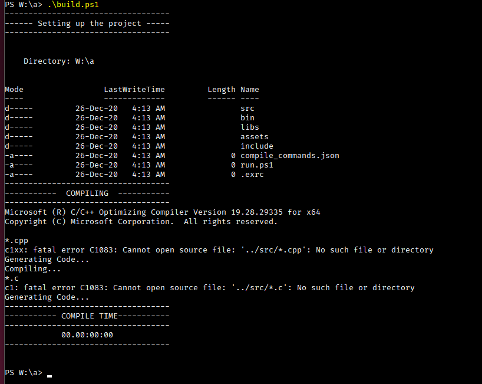
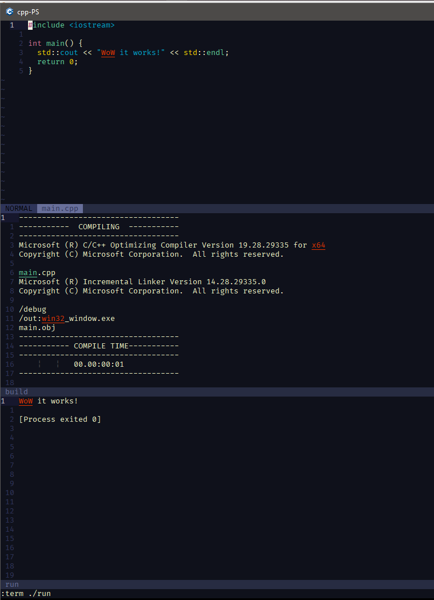

# CPP-Project-Builder for Windows
A Powershell script to set a layout and build projects using msvc cl compiler.

## Table of Content
- [Project Layout](#project-layout)
- [Prerequisites](#prerequisites)
- [Configure](#configure)
- [How to use](#how-to-use)
- [For vim-nvim users](#for-vim-nvim-users)

## Project Layout
this is the layout that will be generated.
```
+ ProjectName
  |- src/
  |- bin/
  |- libs/
  |- assets/
  |- includes/
  |- compile_commands.json  <------ for clangd.
  |- .exrc                  <------ for vim.
  |- run.ps1                <------ just to make things easer for vim.
  |- build.ps1              <------ the downloaded script
``` 
## Prerequisites
1. MSVC (Visual Studio).
1. Powershell and make sure that executing scripts are enabled.
1. vim or nvim optional.
1. clangd optional.

## Configure
- there is a few lines that will generate .exrc file that you can remove if you are not using vim.
- you will need to edit the compile part for your project. I've put an example in the script, please read [compiler](https://docs.microsoft.com/en-us/cpp/build/reference/compiler-options-listed-by-category?view=msvc-160) and [linker](https://docs.microsoft.com/en-us/cpp/build/reference/linker-options?view=msvc-160) docs.

## How to use
- run powershell with msvc dev-shell, with somthing like this.
```PowerShell
Import-Module "C:\Program Files (x86)\Microsoft Visual Studio\2019\Community\Common7\Tools\Microsoft.VisualStudio.DevShell.dll"
Enter-VsDevShell 4f535ba1 -DevCmdArguments '-arch=x64 -no_logo'
```
  you can place these 2 lines in a script and tell your powershell shortcut target to run it e.g.
```
%SystemRoot%\system32\WindowsPowerShell\v1.0\powershell.exe -noe -c "W:\misc\msvc.ps1"
```
- then make a new folder and place build.ps1 in it.
- finally run the script. if everything went right it will out somthing like this



## For vim-nvim users
- add to your _vimrc or init.vim
```vim
set exrc
set secure
```
I've made it so `F6` will build and `F7` will run inside vim.

